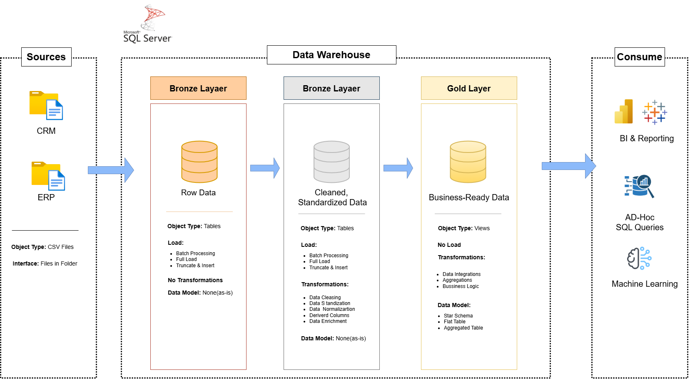

# Data Warehouse and Analytics Project

Welcome to the Data Warehouse and Analytics Project repository! 🚀
This project demonstrates a comprehensive data warehousing and analytics solution, from building a data warehouse to generating actionable insights. Designed as a portfolio project, it highlights industry best practices in data engineering and analytics.

## 🏗️ Data Architecture


- Bronze Layer: Stores raw data as-is from the source systems. Data is ingested from CSV Files into SQL Server Database.
- Silver Layer: This layer includes data cleansing, standardization, and normalization processes to prepare data for analysis.
- Gold Layer: Houses business-ready data modeled into a star schema required for reporting and analytics.

---

## 📊 ETL Process – Implemented Components


### 🔹 1. Extraction

#### ✔ Extraction Type:
- **Full Extraction**  
  A complete data load was performed from the source system whenever required.

#### ✔ Extraction Method:
- **Pull Extraction**  
  The system actively queried and retrieved data from the source.

#### ✔ Extraction Technique:
- **File Parsing**  
  Data was extracted by reading and processing structured files.

---

### 🔹 2. Processing

#### ✔ Processing Type:
- **Batch Processing**  
  Data was processed in scheduled batches instead of real-time streaming.

---

### 🔹 3. Transformation

All transformation components were implemented to ensure data quality, consistency, and business alignment.

### ✔ Data Cleaning:
- Remove duplicates  
- Data filtering  
- Handling missing data  
- Handling invalid values  
- Handling unwanted spaces  
- Data type casting  
- Outlier detection  

#### ✔ Data Normalization & Standardization:
- Standardization of formats (dates, categories, statuses)  
- Column renaming  
- Structural consistency across datasets  

#### ✔ Business Rules & Logic:
- Application of business rules  
- Conditional transformations  
- Data validation logic  

#### ✔ Data Integration:
- Table joins  
- Data merging from multiple sources  
- Relationship mapping  

#### ✔ Data Enrichment:
- Addition of calculated attributes  
- Lookup-based enrichment  

#### ✔ Derived Columns:
- Creation of calculated fields  
- Metric computations  


---

### 🔹 4. Load

#### ✔ Load Method:
- **Full Load**
  The target tables were fully refreshed during the load process.

#### ✔ Load Strategy:
- **Truncate & Insert**
  Existing data was removed before inserting the newly processed dataset.

#### ✔ Slowly Changing Dimensions (SCD):
- **SCD Type 1 (Overwrite)**
  Existing records were updated without keeping historical changes.

---

## 📖 Project Overview

This project involves:

- **Data Architecture:** Designing a Modern Data Warehouse using Medallion Architecture (Bronze, Silver, and Gold layers).  
- **ETL Pipelines:** Extracting, transforming, and loading data from source systems into the warehouse.  
- **Data Modeling:** Developing fact and dimension tables optimized for analytical queries.  
- **Analytics & Reporting:** Creating SQL-based reports and dashboards for actionable insights.  

---

## 🚀 Project Requirements

### 🏗️ Building the Data Warehouse (Data Engineering)

#### 🎯 Objective

Develop a modern data warehouse using SQL Server to consolidate sales data, enabling analytical reporting and informed decision-making.

---

#### 📋 Specifications

- **Data Sources:** Import data from two source systems (ERP and CRM) provided as CSV files.  

- **Data Quality:** Cleanse and resolve data quality issues prior to analysis.  

- **Integration:** Combine both sources into a single, user-friendly data model designed for analytical queries.  

- **Scope:** Focus on the latest dataset only; historization of data is not required.  

- **Documentation:** Provide clear documentation of the data model to support both business stakeholders and analytics teams.

  ---

## 📊 BI: Analytics & Reporting (Data Analysis)

#### 🎯 Objective

Develop SQL-based analytics to deliver detailed insights into:

- **Customer Behavior**  
- **Product Performance**  
- **Sales Trends**  

These insights empower stakeholders with key business metrics, enabling strategic decision-making.

--- 

## 📂 Repository Structure

```text
data-warehouse-project/
│
├── datasets/                           
│   └── Raw datasets used for the project (ERP and CRM data)
│
├── docs/                               
│   ├── etl.drawio                # Draw.io file showing ETL techniques and methods
│   ├── data_architecture.drawio  # Project architecture diagram
│   ├── data_catalog.md           # Dataset catalog including field descriptions and metadata
│   ├── data_flow.drawio          # Data flow diagram
│   ├── data_models.drawio        # Data models (Star Schema)
│   ├── naming-conventions.md     # Naming standards for tables, columns, and files
│
├── scripts/                            
│   ├── bronze/                   # Raw data extraction and initial load scripts
│   ├── silver/                   # Data cleaning and transformation scripts
│   ├── gold/                     # Analytical model creation scripts
│
├── tests/                              
│   └── Test scripts and data quality validation files
│
├── README.md                       # Project overview and documentation
├── LICENSE                         # Repository license information
